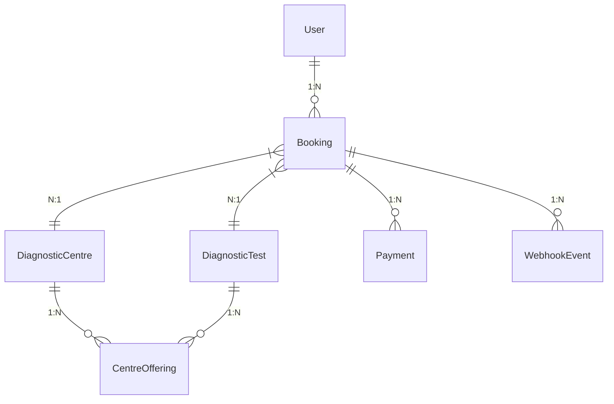

# EVE Healthcare Backend


Simulated diagnostic booking service: JWT auth, centres/tests catalogue, server-priced bookings, simulated payments, idempotent webhooks. Modular monolith — FastAPI + PostgreSQL + SQLAlchemy 2.x + Alembic.

## Overview

Authenticated users browse diagnostic centres/tests, book a test at a centre (price snapshotted server-side), pay via a simulated endpoint, and an external-provider-style webhook reconciles payment state. Webhook processing is idempotent and transaction-safe.

## Tech Stack

Python 3.11+, FastAPI, SQLAlchemy 2.x, Alembic, PostgreSQL (psycopg), Pydantic v2 / pydantic-settings, PyJWT, bcrypt, pytest + httpx/TestClient. Vanilla JS demo frontend in `frontend/`.

## Features

- `POST /auth/signup`, `POST /auth/login`, `GET /users/me` (JWT Bearer)
- `GET/POST /centres`, `PATCH /centres/{id}`, `GET/POST/PATCH /tests`, `POST /offerings`
- `POST /bookings` (server price snapshot, PENDING), `GET /bookings`, `GET /bookings/{id}`, `POST /bookings/{id}/cancel`
- `POST /payments/` (simulated SUCCESS/FAILED, deterministic via `simulate_outcome`)
- `POST /payments/webhook/` (idempotent)
- Request-ID middleware + `X-Request-ID` header, structured JSON logs, pagination (`limit`/`offset`), seed script, Docker files, Swagger at `/docs`

## Project Structure

```
app/main.py  app/core/{config,security,exceptions,logging}
app/db/{session,base}  app/models/__init__.py  app/schemas/__init__.py
app/api/{deps,routes/auth,users,centres,tests,bookings,payments,webhooks}
app/services/__init__.py  app/seed.py  alembic/  tests/  frontend/index.html
```

No generic repository layer — services own queries. This keeps the codebase explainable and avoids fake enterprise abstraction.

## Database Design



- `users.email` UNIQUE (stored lowercase); `centre_offerings(centre_id,test_id)` UNIQUE; `webhook_events.external_event_id` UNIQUE; `payments.provider_payment_id` UNIQUE.
- Money: `NUMERIC(10,2)` + `CHECK(price>=0)`. Never float.
- Timestamps: `timestamptz`. PKs: UUIDv4 (native on Postgres).
- FKs: bookings → centres/tests `RESTRICT` (old bookings survive catalogue edits); offerings `CASCADE`.

## API Endpoints

| Method | Route | Auth | Example |
|---|---|---|---|
| POST | `/auth/signup` | no | `{"name":"Aarav","email":"a@x.com","password":"s3cure-pass"}` → 201 User |
| POST | `/auth/login` | no | `{"email":"a@x.com","password":"…"}` → `{"access_token":"…"}` |
| GET | `/users/me` | Bearer | → current user |
| GET | `/centres?limit=20&offset=0` | Bearer | list |
| POST | `/centres` | Bearer | `{"name":"CityCare","location":"Bengaluru"}` |
| GET/POST | `/tests`, `/offerings` | Bearer | catalogue + price wiring |
| POST | `/bookings` | Bearer | `{"centre_id":"uuid","test_id":"uuid","appointment_at":"2030-05-01T10:00:00Z"}` → PENDING with snapshot amount |
| POST | `/bookings/{id}/cancel` | Bearer (owner) | PENDING/CONFIRMED → CANCELLED |
| POST | `/payments/` | Bearer (owner) | `{"booking_id":"uuid","simulate_outcome":"SUCCESS"}` |
| POST | `/payments/webhook/` | none (provider) | `{"event_id":"evt_123","event_type":"payment.succeeded","payment_id":"pay_123","booking_id":"uuid","amount":"499.00","status":"SUCCESS"}` |

Full schemas + examples in Swagger (`/docs`).

## Authentication

bcrypt hash on signup; login verifies and returns JWT (`sub=user_id`, `iat/exp`, `HS256`, secret + expiry from env). `get_current_user` decodes, loads user, rejects missing/invalid/inactive with 401. Passwords/secrets never logged.

## Booking Lifecycle

```
PENDING → CONFIRMED | FAILED | CANCELLED
CONFIRMED → CANCELLED
FAILED, CANCELLED → terminal
```

Server derives owner, amount (from offering), status. Client price/status ignored. Invalid transition → 409. Cancel of terminal → 409.

## Price Snapshot

`Booking.amount` is copied from `CentreOffering.price` at creation and never updated. Later price edits only affect new bookings. Covered by `test_price_snapshot_survives_offering_change`.

## Payment Flow

`POST /payments/`: auth → booking exists + owned → must be PENDING → `SELECT … FOR UPDATE` → create `Payment(pay_<rand>, amount=booking.amount)` → set booking CONFIRMED/FAILED in one transaction. `simulate_outcome` makes tests deterministic; omit → SUCCESS.

## Webhook Idempotency

1. Validate payload. 2. If `event_id` exists → `200 {deduped:true}`, no writes. 3. Else lock booking (`FOR UPDATE`), verify payment↔booking linkage and amount, compute target state. 4. Terminal bookings (CANCELLED/FAILED) are never resurrected — late SUCCESS is recorded but ignored. 5. Same-state redelivery with new `event_id` records event without state change. 6. `INSERT webhook_event` + upsert payment + update booking in one transaction; `IntegrityError` on UNIQUE → treat as deduped (covers simultaneous duplicates). DB constraint (not memory) is the guarantee.

## Running Locally

```bash
pip install fastapi "uvicorn[standard]" "sqlalchemy>=2.0" alembic "psycopg[binary]" \
  "pydantic>=2.7" pydantic-settings PyJWT bcrypt email-validator python-multipart pytest httpx
cp .env.example .env   # set DATABASE_URL, JWT_SECRET
createdb eve eve_test  # or use existing postgres
alembic upgrade head
python -m app.seed     # demo@eve.health / demo-pass-1
uvicorn app.main:app --reload
# docs: http://localhost:8000/docs | frontend: open frontend/index.html
```

## Running with Docker

```bash
JWT_SECRET=<long-random> docker compose up --build
docker compose exec app alembic upgrade head
```

## Database Migration

```bash
alembic upgrade head
alembic revision --autogenerate -m "describe change"
```

## Running Tests

```bash
TEST_DATABASE_URL="postgresql+psycopg://dairel@localhost:5432/eve_test" python -m pytest tests/ -q
# 33 tests: auth, catalogue, bookings, payments, webhooks, authorization, edge cases
```

Tests use an isolated DB (drop/create per test) and override `get_db`. SQLite fallback in `conftest.py` lets pytest run without Postgres, but Postgres is the primary target.

## Seed Data

```bash
python -m app.seed
```

2 centres, 3 tests, 4 offerings, demo user. Idempotent; dev only, never imported by app code.

## Requirements Checklist

| Requirement | Status | Implementation |
|---|---|---|
| Authentication | Complete | signup/login/JWT/me, bcrypt |
| Centres & Tests | Complete | CRUD + offerings with price |
| Bookings | Complete | state machine, snapshot, owner checks |
| Payments | Complete | simulated, transactional, deterministic |
| Webhook | Complete | idempotent, UNIQUE + txn + FOR UPDATE |
| Edge Cases | Complete | 33 tests incl. dupes, races, mismatches |
| Docs | Complete | README + Swagger |

## Assumptions

- Any authenticated user may manage the catalogue (no RBAC; documented simplification).
- Webhook endpoint is unauthenticated (provider-style); linkage/amount checks are the guard. Production would add HMAC signature verification.
- UUID PKs (plan choice); examples using `123` in the brief map to UUID strings.
- Not HIPAA/PCI compliant; payments simulated.

## Trade-offs

- Skipped repositories/ folder, Redis, Celery, rate-limiting, retry queues — no architectural benefit at this scale; webhook retries are safe via idempotency alone.
- Pagination is simple limit/offset, not cursor-based.
- Catalogue writes are open to all authenticated users to avoid RBAC complexity.

## Future Improvements

Provider HMAC verification, admin roles, cursor pagination, OpenTelemetry tracing, refresh tokens, Postgres advisory locks for high-contention webhooks.
